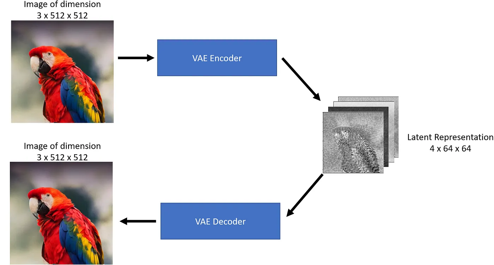

# Capstone Science Fair Project
Using Stable Diffusion's Variational Autoencoders for Image Compression.

This project is currently a work in progress.

The ultimate goal of this project is to be able to compress image sizes while maintaining the same quality of the original image.

This script will work on most Stable Diffusion UIs, however [Automatic1111](https://github.com/AUTOMATIC1111/stable-diffusion-webui) was utilized for the purposes of this project.

# Features
- Img2img image compression
- File size reduction 

# Credits 
Automatic1111 - https://github.com/AUTOMATIC1111/stable-diffusion-webui

VAE Example Image - https://towardsdatascience.com/stable-diffusion-using-hugging-face-501d8dbdd8

Diffusers Library - https://github.com/huggingface/diffusers

Transformers Library - https://github.com/huggingface/transformers

