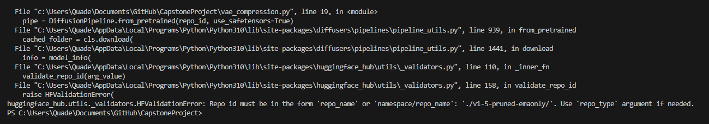

# Capstone Science Fair Project Logbook

## 9-25-2023

The project goal for today was to start implementing the VAE code while using the actual huggingface site as little as possible. 

Installed essential libraries Pytorch, Diffusers, and Transformers to python environment.

Wrote code that initializes a prompt and generates an image using it, although i met an error in that the model cannot be found.

Changed README to include more information such as the project's ultimate final goal.

## 10-2-2023

[link to test code](https://towardsdatascience.com/stable-diffusion-using-hugging-face-501d8dbdd8)

[from_pretrained help](https://huggingface.co/docs/diffusers/using-diffusers/loading)

Worked on new code to utilize model following hugging face's official from_pretrained guide. Previous code was not working due to no model found. Hugging Face's online API seems to be the best (and likely only) way to utilize the model although using it through python code has proved very difficult. I think it will be my main path forward.

The following is an image of the error I am currently recieving:

I believe this error is coming from my avoidance of the hugging face API but I think I have no other choice than to access the repositories held on the site instead of using local files.

## 10-3-2023

