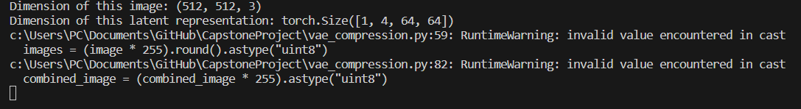

# Capstone Science Fair Project Logbook

## 9-25-2023

The project goal for today was to start implementing the VAE code while using the actual huggingface site as little as possible. 

Installed essential libraries Pytorch, Diffusers, and Transformers to python environment.

Wrote code that initializes a prompt and generates an image using it.

Changed README to include more information such as the project's ultimate final goal.

## 10-2-2023

[link to test code](https://towardsdatascience.com/stable-diffusion-using-hugging-face-501d8dbdd8)

[from_pretrained help](https://huggingface.co/docs/diffusers/using-diffusers/loading)

Worked on code to utilize model as the previous code was not working despite no major errors occuring. (The model was not found)

## 10-12-2023 

Created code that would log into huggingface to pull the models from online so this program can be run remotely.

Successfully initialized the model and prompt, but ran into an error when trying to pass the prompt through the model.

Added code that can tokenize a prompt and print those tokens with their english counterparts.

Installed libraries fast download matplotlib using pip

Added code that can perform VAE compression on an image and it seemed to work, at least in the backend side of things, despite some runtime warnings. There is currently no way to actually view this image as it is not compatible with cv2 in its current form so I will need to add some method of viewing the image. Following is the response the code gives when ran, showing that the program is working in theory:

## 10-16-2023

Separated the code into its different functionalities, specifically made a new file for the token test code because it is not used in vae_compression.py but may be needed later down the line.